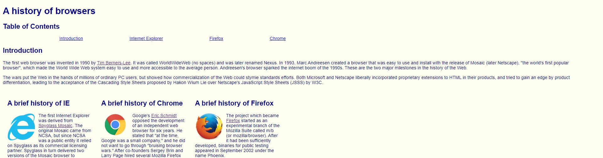
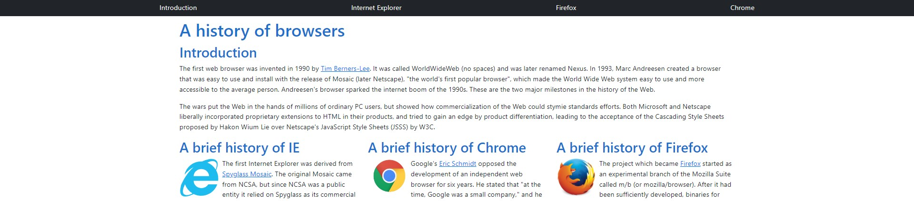

## UI Frameworks

User Interface (UI) frameworks are pre-built libraries of reusable code that make it easier to create consistent and aesthetically pleasing user interfaces. While these frameworks can be quite complex and may possess a learning curve not too dissimilar to learning a new language, the benefits that they can offer to software developers and web designers certainly make them worth the time and effort to learn. 

At first glance, UI Frameworks like Bootstrap 5 may seem like an unnecessary complication. After all, HTML and CSS are fairly straightforward to learn, and there are many resources available to help developers create custom styles and layouts from scratch. However, after spending a week creating a web page in raw HTML / CSS and another using Bootstrap 5, I can confidently say that I never want to ever code using raw HTML / CSS again. To draw a comparison, UI frameworks function similarly to function libraries like Underscore in that they can allow developers to skip over the tedious and repetitive process of styling each component, or function in the case of JavaScript, from scratch as each of the pre-built styles and components have already been tested and proven to work well together. 

## Personal Experience
In my first experience with HTML / CSS and Bootstrap 5, I had to create a web page that detailed the history of various web browsers. When trying to design the entire page using raw HTML / CSS, I quickly realized that when I changed the browser size my page contents would not automatically adjust according to the new dimensions. After switching over to Bootstrap 5, I found that my problem was easily solved after just wrapping all of the contents with a div tag and giving it the container class. Although simple, this one design demonstrated to me the power of using UI frameworks, Bootstrap 5 in particular. Rather than spending the time and effort of manually coding out the style specification for various screen sizes and host devices, I can simply use a pre-built class and move on to the next design component of my page.

Raw HTML / CSS :

Bootstrap 5 :

Overall, while UI frameworks like Bootstrap 5 do require an investment of time and effort to learn, they ultimately offer a number of software engineering benefits. By using pre-built components, developers can save time and create consistent and visually appealing designs. Even though it is certainly possible to build web applications using raw HTML and CSS, doing so is more time-consuming and error-prone, especially when working on larger projects with complex requirements. It is for these reasons, I would highly recommend that any software developer who is serious about building a user friendly and responsive UI should consider learning and using a UI framework like Bootstrap 5.
