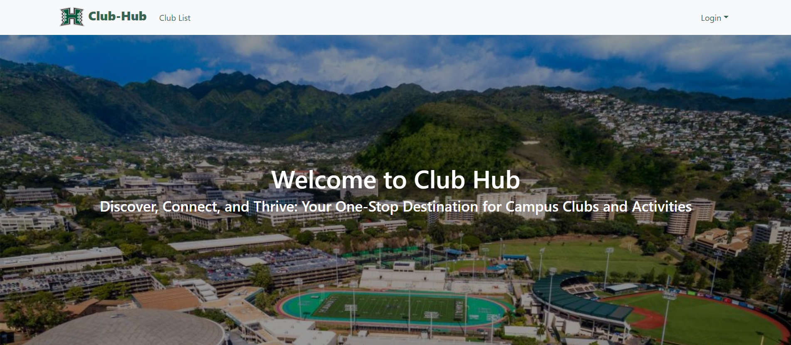
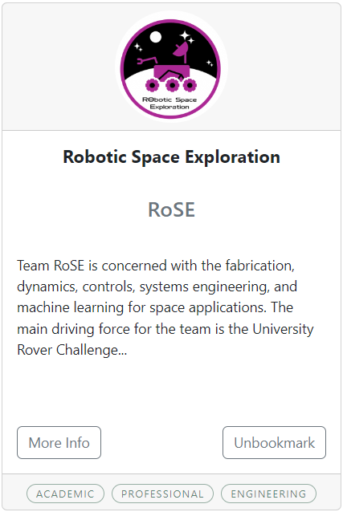
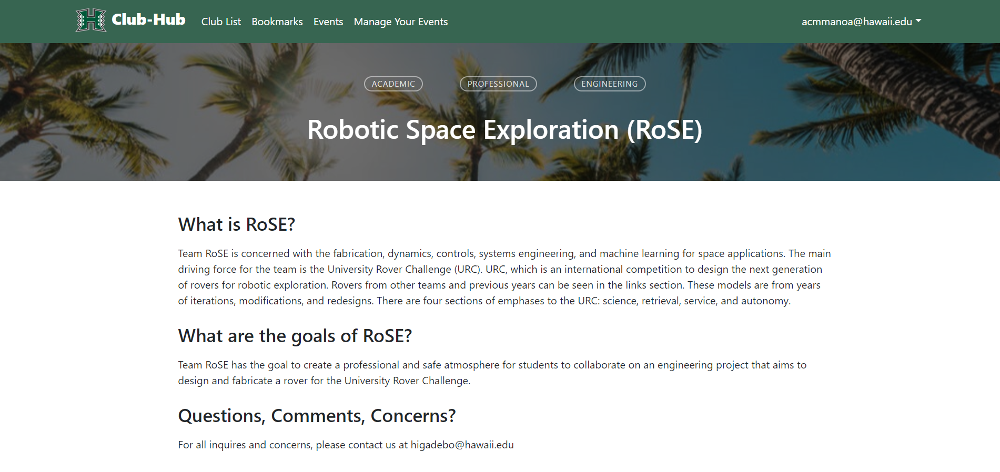

  

## What is Club Hub

[Club Hub](https://club-hub.site/) is a web application specifically designed for the UH Mānoa community to facilitate easy discovery, connection, and engagement with various clubs and organizations on campus. By providing a centralized platform for students, Club Hub simplifies the process of finding clubs aligned with their interests, accessing information about a specific club, and keep tabs on upcoming events. Club Hub not only benefits students but also serves as a valuable tool for club leaders as it allows them efficiently manage events and provide detailed information about their clubs to prospective members. With its user-friendly interface and features tailored to the needs of the university community, Club Hub aims to enrich the campus experience by fostering a vibrant and connected student life.

## Responsibilities and Contributions

As a member of a five-person team, my contributions for this project involved implementing the UI design for all the club pages and components, creating the club info pages, and managing the page routing. To begin, based on the initial mock design created by my partners, I implemented and managed the overall layout and design for all the pages and components, such as the club cards, navbar, and landing page. Additionally, I focused on developing the club info pages, ensuring that they page  fetched the appropriate club data from the collections based on the URL. Furthermore, I took charge of managing the page routing using React Router, creating dynamic routes for club pages based on their unique slugs and ensuring smooth navigation throughout the application and implementing the appropriate protections for each route to prevent unauthorized access to certain pages. Throughout the project, I actively participated in team meetings, provided constructive feedback to my teammates, and iterated on the design and functionality based on user feedback and testing results, ultimately contributing to the successful completion of the project.

  
  

## Lessons learned
In this project, I learned valuable lessons about effective teamwork, communication, and the importance of adaptability in a dynamic development environment. Working as part of a five-person team taught me the significance of collaboration and coordinating tasks to efficiently distribute workload. I gained insights into the best practices for maintaining a consistent codebase, version control using Git, and conducting code reviews to ensure high-quality results. Moreover, I honed my software development skills and deepened my understanding of dynamic web design principles, Meteor, and MongoDB collections.

Source Code : [GitHub](https://github.com/mongo-mongoers/club-hub)
Project Home Page : [GitHub.io](https://mongo-mongoers.github.io/)
