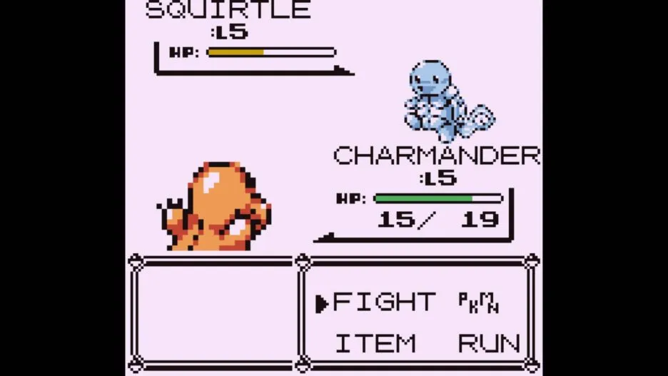

<div class="text-center p-4">
  
</div>

## What is Pokemon GUI

Pokemon is a popular media franchise centered around fictional creatures called "Pokemon", which humans, known as Pokemon Trainers, catch and train to battle each other for sport. Our goal is to create a text-based implementation of the Pokemon battle system using Java. Our program boasts an authentic battle system that closely simulates the gameplay mechanics of the classic Pokemon games. This includes the incorporation of fast attacks, special attacks, and energy-building mechanics, providing players with a truly immersive experience. Additionally, the program features a minimum of 13 different Pokemon, with the capability of easily implementing new Pokemon in the future. 

## Responsibilities

As the lead programmer for this project, I was tasked with the responsibility of designing and implementing the various functionalities and assets of the Graphical User Interface (GUI). To begin, I constructed a parent Pokemon class from which all other Pokemons were derived, as well as several "type" interfaces that were implemented by the Pokemons based on their specific characteristics. After creating the necessary assets for the Pokemons and their types, I moved on to conceptualizing the overall layout of the GUI through a design sketch. Utilizing the Swing library, a powerful toolkit for GUI development in Java, I crafted a visually pleasing and user-friendly interface by implementing a card layout structure that clearly separated the Pokemon, Pokedex, and Backpack features into distinct and independent fields.

## Lessons

This project presented a unique opportunity for me to expand my knowledge and expertise in the realm of Java programming, specifically in the area of graphical user interface (GUI) development. As a novice in this field, I was challenged to familiarize myself with the intricacies of utilizing the Swing library to create and manipulate various graphical elements, such as buttons, text fields, and images. Through this process, I was able to develop a comprehensive understanding of how to design and implement an elegant and user-friendly GUI. Despite the challenges I faced, I found the experience to be intellectually stimulating and immensely fulfilling. I am proud of the final outcome of this project and the skills and knowledge I have gained through this experience.

## Sample Code

Here is some code of a helper function that offers players the choice to reselect their pokemon if they so choose so:

```java
 public static Pokemon reChoose(Pokemon p) {
      
      boolean reChoose = true;
      String yesNo = "";
      Pokemon poke = p;
      Scanner userIn = new Scanner(System.in);
      
      while (reChoose) {
         System.out.println("Would you like to reroll your pokemon? Y/N");
         yesNo = userIn.nextLine();
         yesNo = yesNo.toUpperCase().trim();
         
         // Switch based on player's choise
         switch (yesNo) {
            case "Y": //Reroll Pokemon
               poke = choosePokemon(); 
               System.out.println(poke);          
               break;
            case "N": //Keep Pokemon
               reChoose = false;
               break;
            default: //Invalid choice
               System.out.println("\n=======Invalid Menu Choice=======");
               System.out.println("Please enter Y/N");
               System.out.println("=================================\n");
               break;
         } // Closes Switch
      } // Closes while loop
      return poke;
}
```


Source : [GitHub](https://github.com/LuuDanny/Pokemon-PvP).
