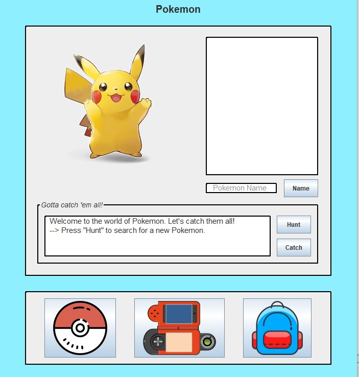

<div class="text-center p-4">
  
</div>

Pokemon Go is a mobile game developed by Niantic, in which players use their mobile device's GPS to locate, capture, battle, and train virtual creatures called Pokemon. The goal of this project is to utilize Java to develop a GUI (Graphical User Interface) to emulate Pokemon Go's search and capture features in a style reminiscent of the base Pokemon games. Additional features that need to be implemented included a "Pokedex" and "Backpack." The Pokedex would record the information of any spotted Pokemon and keep track of the number of instances a particular Pokemon has either been spotted and/or caught. The Backpack would only store the information of Pokemon that have been caught and can be sorted in any manner from a selection of 5 choices. In order to allow for future expansions, the Pokemon objects need to be implemented in such a way that new Pokemon can easily be added.

For this project, I was the lead programmer who was responsible for programming the various funtionality and assests of the GUI.  I started by programming the basics, such as sensor polling and motor actuation using interrupts.  From there, I then programmed the basic PD controls for the motors of the mouse.  The PD control the drive so that the mouse would stay centered while traversing the maze and keep the mouse driving straight.  I also programmed basic algorithms used to solve the maze such as a right wall hugger and a left wall hugger algorithm.  From there I worked on a flood-fill algorithm to help the mouse track where it is in the maze, and to map the route it takes.  We finished with the fastest mouse who finished the maze within our college.

Here is some code of a helper function that updates the pokedex and text fields depending on the Pokemon that has been spotted:

```java
public void hunt(Pokemon p) {
      pokedexBST.seen(p);
      textArea.setText("  A wild " + p.getSpecies() + " has appeared!" 
            + HUNTMSG + CATCHMSG);
      
      textArea2.setText("   Number: " + p.getNumber()
            + "\n\n   Species: " + p.getSpecies() 
            + "\n\n   Type: " + p.getType()
            + "\n\n   Height: " + p.getHeight() 
            + "\n\n   Weight: " + p.getWeight()
            + "\n\n   HP: " + p.getHP() 
            + "\n\n   CP: " + p.getCP() + "\n");
   }
```

Source : [GitHub](https://github.com/LuuDanny/Pokemon-GUI).
